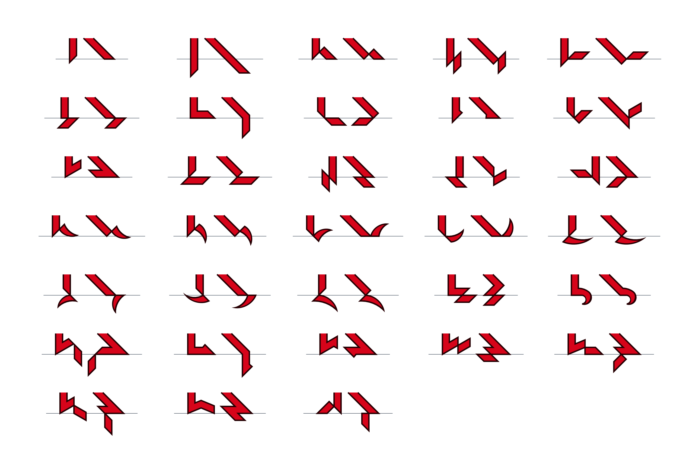
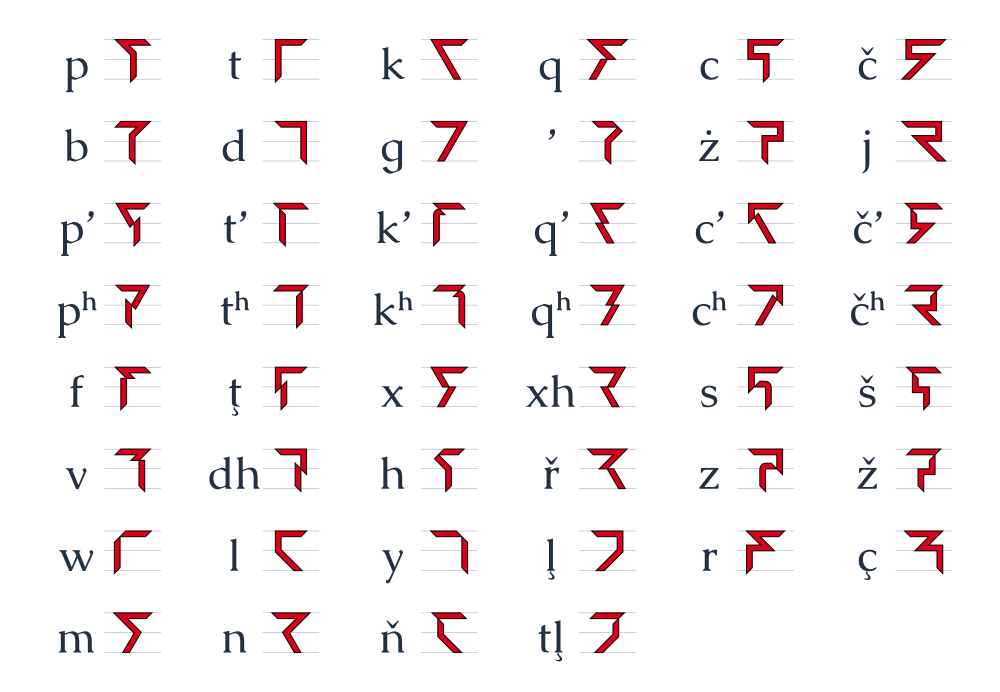
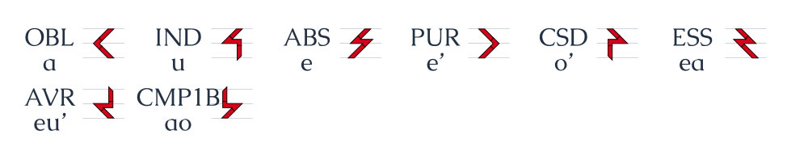
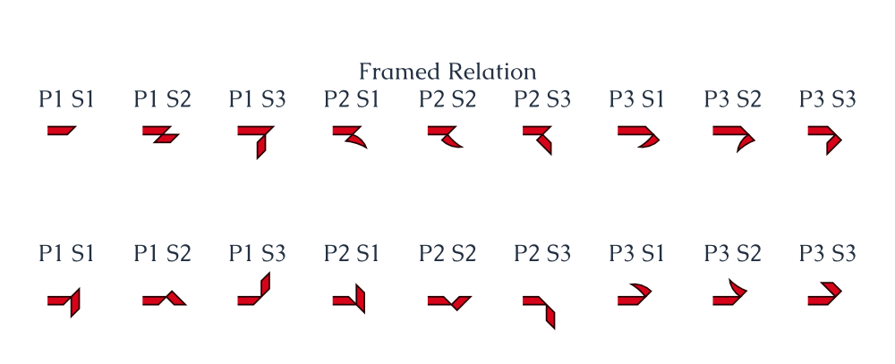

# Ithkuil Tools

 This is an attempt to implement the entire Ithkuil constructed language in code.

 Due to the very regular and consistent language design, and because most of the complexity of the language is in the grammar instead of in the vocabulary, Ithkuil is a very good candidate for implementing in code.

 The specification for the language, which is the primary source material for this set of tools, can be found at [Ithkuil.net](http://ithkuil.net/).

 Ithkuil was created by John Quijada.

 ## Related Projects

 - [Emacs Input Method](https://bitbucket.org/pdonnelly/romanized-ithkuil-emacs-ime) for diacritics in Ithkuil by Paul Donnelly.

 ## Charts

 
 
 
 
